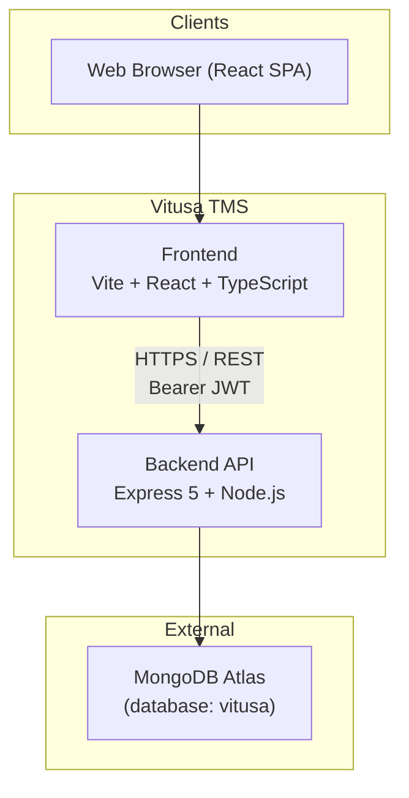
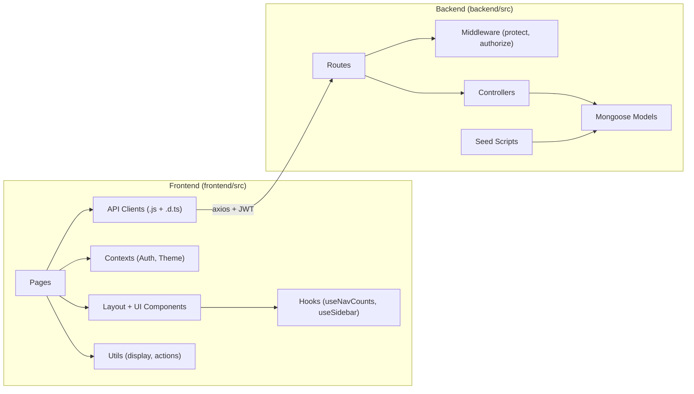
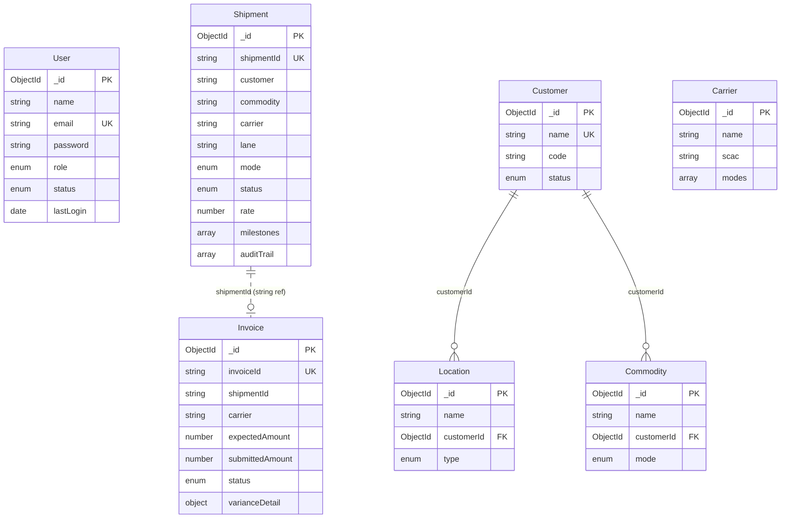
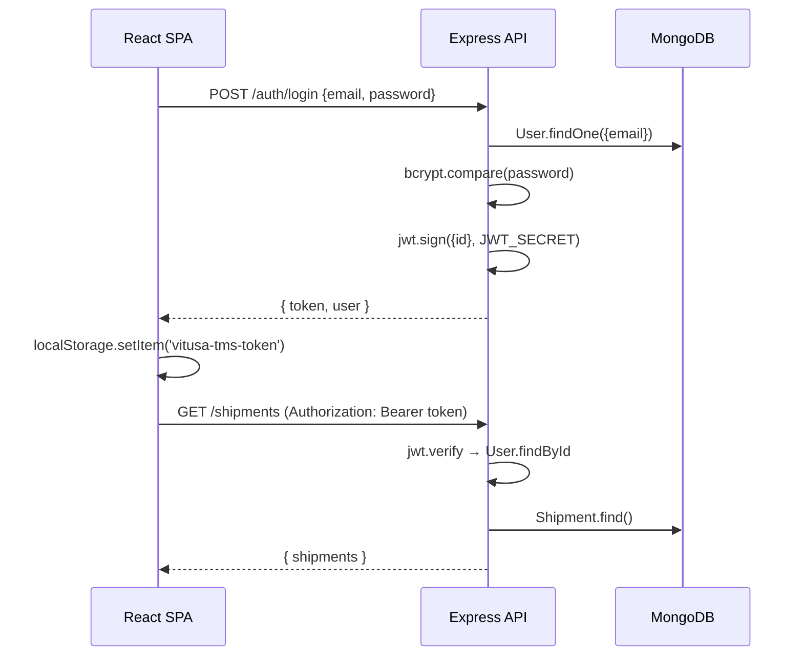
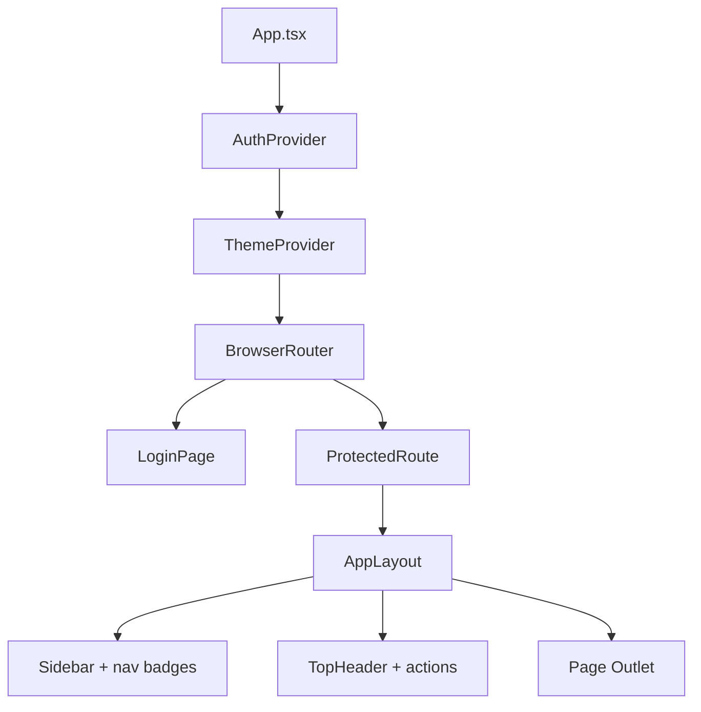
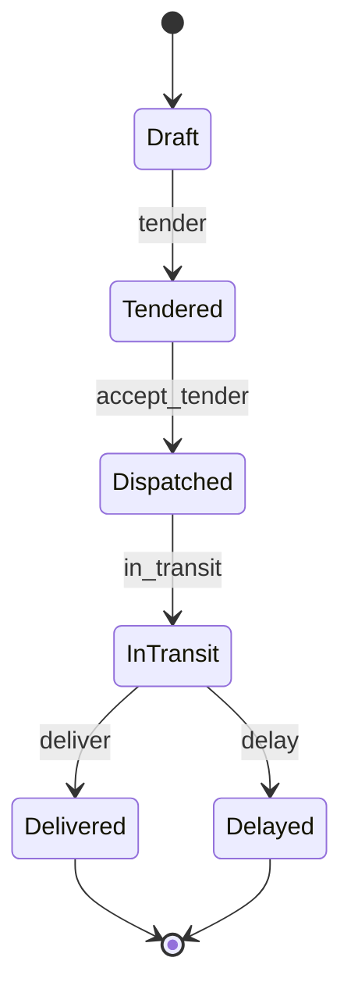
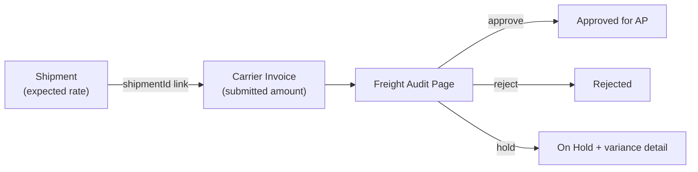
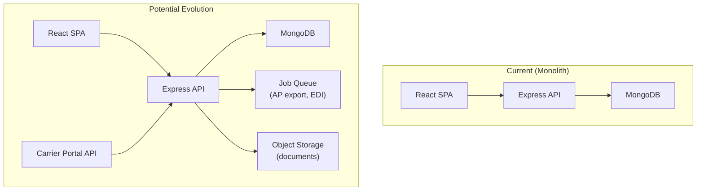

# Vitusa TMS — Architecture

Vitusa TMS is a **Transportation Management System** built as a monolithic three-tier web application: a React SPA frontend, a Node.js/Express REST API backend, and MongoDB Atlas as the data store. It supports shipment lifecycle management, master data, freight audit/AP workflows, and role-based access for internal and carrier users.

**Repository layout**

| Path | Stack |
|------|-------|
| `backend/` | Express 5, Mongoose, JWT (this repo) |
| `frontend/` | React 19, TypeScript, Vite, Tailwind CSS 4 (sibling project) |

---

## 1. System Context



| Layer | Technology | Purpose |
|-------|-----------|---------|
| Frontend | React 19, TypeScript, Vite, Tailwind CSS 4, React Router 7, Axios | Control tower UI |
| Backend | Express 5, Mongoose 9, JWT, bcryptjs, Helmet, CORS | REST API + business logic |
| Database | MongoDB Atlas | Document store |
| API Docs | OpenAPI 3 + Swagger UI (`/api/docs`) | Contract documentation |
| Dev tooling | nodemon, seed scripts | Local development |

**Deployment model (current):** two separate apps — backend on port `5000`, frontend on the Vite dev server — connected via `VITE_API_URL` (defaults to `http://localhost:5000/api`).

---

## 2. High-Level Architecture

The system follows a **layered MVC-style pattern** on the backend and a **page + API client** pattern on the frontend.



---

## 3. Backend Architecture

### 3.1 Entry Point & Application Bootstrap

```
server.js
  ├── dotenv config
  ├── connectDB()          → MongoDB via MONGODB_URI
  └── app.listen(PORT)

app.js
  ├── express.json()
  ├── cors(), helmet()
  ├── /api/docs            → Swagger UI
  └── Route mounts:
        /api/auth
        /api/shipments
        /api/dashboard
        /api/users
        /api/master-data
        /api/invoices
```

### 3.2 Layer Responsibilities

| Layer | Location | Responsibility |
|-------|----------|----------------|
| **Routes** | `src/routes/*.js` | HTTP method + path mapping, middleware chain |
| **Middleware** | `src/middleware/authMiddleware.js` | JWT verification (`protect`), RBAC (`authorize`) |
| **Controllers** | `src/controllers/*.js` | Business logic, validation, response formatting |
| **Models** | `src/models/*.js` | Mongoose schemas, enums, embedded subdocuments |
| **Config** | `src/config/` | DB connection, Swagger document assembly |
| **Seed** | `src/seed/` | Dev/demo data population |

### 3.3 API Surface

#### Authentication — `/api/auth`

| Method | Path | Auth | Description |
|--------|------|------|-------------|
| POST | `/login` | Public | Returns JWT + user |
| GET | `/me` | protect | Current user profile |
| POST | `/register` | admin only | Create user |

#### Shipments — `/api/shipments`

| Method | Path | Auth | Description |
|--------|------|------|-------------|
| GET | `/` | protect | List shipments (filterable) |
| POST | `/` | protect | Create shipment |
| GET | `/:id` | protect | Detail by `shipmentId` |
| PATCH | `/:id` | protect | Lifecycle action update |

**Shipment lifecycle actions** (action-based PATCH):

```
Draft → tender → Tendered → accept_tender → Dispatched
  → in_transit → In Transit → deliver → Delivered
  → delay → Delayed (from In Transit)
```

Each action updates: `status`, `milestones[]`, `auditTrail[]`, and optionally `carrierInfo`.

#### Dashboard — `/api/dashboard`

| Method | Path | Auth | Description |
|--------|------|------|-------------|
| GET | `/` | protect | Aggregated KPIs, pipeline, active loads, exceptions |

Computed server-side from all shipments — no separate analytics database.

#### Users (Administration) — `/api/users`

| Method | Path | Auth | Description |
|--------|------|------|-------------|
| GET | `/` | admin | List users |
| POST | `/` | admin | Create user |
| PATCH | `/:id` | admin | Update user |
| DELETE | `/:id` | admin | Delete user |

#### Master Data — `/api/master-data`

| Method | Path | Auth | Description |
|--------|------|------|-------------|
| GET | `/summary` | protect | Entity counts |
| GET | `/customers`, `/locations`, `/carriers`, `/commodities` | protect | List entities |
| POST | `/customers`, `/locations`, `/carriers`, `/commodities` | admin, coordinator | Create entities |

#### Freight Audit — `/api/invoices`

| Method | Path | Auth | Description |
|--------|------|------|-------------|
| GET | `/summary` | protect | Approved/on-hold/match-rate stats |
| GET | `/` | protect | Invoice queue |
| GET | `/:id` | protect | Invoice detail (by `invoiceId` or MongoDB `_id`) |
| PATCH | `/:id` | admin, finance | approve / reject / hold |

---

## 4. Data Architecture

### 4.1 Entity Relationship Model



**Design choice:** Shipments and Invoices use **denormalized string references** (`customer`, `carrier`, `shipmentId`) rather than MongoDB `ObjectId` foreign keys. Master Data entities (`Location`, `Commodity`) use `ObjectId` refs to `Customer`. This keeps shipment reads fast but means referential integrity is application-level, not database-enforced.

### 4.2 Core Domain Models

#### Shipment (`src/models/Shipment.js`)

The central aggregate. Rich embedded documents:

- `milestones[]` — lifecycle tracking
- `bulkRequirements[]` — mode-specific rules
- `documents[]` — BOL, certs, etc.
- `auditTrail[]` — action history
- `freightCost` — `{ base, fsc }`
- `carrierInfo` — tender status/detail

Statuses: `Draft | Tendered | Dispatched | In Transit | Delivered | Delayed | Blind | Exception`

#### Invoice (`src/models/Invoice.js`)

Freight audit entity for 3-way match:

- Links to shipment via `shipmentId` string
- `varianceDetail` embedded: base rate, FSC, unauthorized accessorial, reason
- Statuses: `Pending | Approved | On Hold | Rejected`

#### User (`src/models/User.js`)

Roles: `admin | coordinator | finance | carrier`

Also tracks `carrierPortal` access level and `department`.

---

## 5. Security Architecture



### Authentication

- **JWT** stored in `localStorage` (`vitusa-tms-token`)
- Axios interceptor attaches `Authorization: Bearer <token>` on every request
- On app load, `AuthContext` calls `GET /auth/me` to validate stored token

### Authorization (RBAC)

| Role | Capabilities |
|------|-------------|
| **admin** | Full access; user management; invoice approve/reject |
| **coordinator** | Shipments, master data create, dashboard |
| **finance** | Freight audit approve/reject/hold; read-only elsewhere |
| **carrier** | Intended for carrier portal (not yet wired to API) |

Middleware pattern:

```js
router.use(protect)
router.patch("/:id", authorize("admin", "finance"), updateInvoice)
```

Frontend guards:

- `ProtectedRoute` — requires login
- `AdminRoute` — requires `role === 'admin'`
- Page-level checks (e.g. Freight Audit action buttons for admin/finance only)

---

## 6. Frontend Architecture

### 6.1 Directory Structure

```
frontend/src/
├── api/              # Axios clients (.js) + TypeScript types (.d.ts)
├── components/
│   ├── auth/         # ProtectedRoute, AdminRoute
│   ├── layout/       # AppLayout, Sidebar, TopHeader
│   ├── ui/           # Badge, Button, GlassCard, Tabs, ThemeToggle
│   └── icons/
├── contexts/         # AuthContext, ThemeContext
├── data/             # navigation.ts, roleDefinitions.ts, templates
├── hooks/            # useNavCounts, useSidebar
├── pages/            # Route-level page components
└── utils/            # shipmentActions, shipmentDisplay, userDisplay
```

### 6.2 Routing Map

| Path | Page | API Integration |
|------|------|-----------------|
| `/` | LoginPage | authApi |
| `/dashboard` | DashboardPage | dashboardApi |
| `/shipments` | ShipmentsPage | shipmentApi |
| `/shipments/:id` | ShipmentDetailPage | shipmentApi + action utils |
| `/create-shipment` | CreateShipmentPage | shipmentApi + masterDataApi |
| `/master-data` | MasterDataPage | masterDataApi (partial — some tabs mock) |
| `/freight-audit` | FreightAuditPage | invoiceApi |
| `/reports` | ReportsPage | **Mock data** |
| `/administration` | AdministrationPage | userApi (users tab live; other tabs mock) |
| `/carrier-portal` | CarrierPortalPage | **Mock data** (standalone layout, no auth) |

### 6.3 Layout Shell



`AppLayout` wraps all authenticated pages and provides:

- Responsive sidebar with role-filtered nav (administration hidden for non-admins)
- Live nav badges via `useNavCounts` (active shipments, on-hold invoices)
- Per-page header actions (e.g. "Export AP File" on Freight Audit)

### 6.4 API Client Pattern

Each domain has a `.js` client + `.d.ts` types:

```js
const api = axios.create({ baseURL: VITE_API_URL })
api.interceptors.request.use((config) => {
  config.headers.Authorization = `Bearer ${localStorage.getItem('vitusa-tms-token')}`
  return config
})
```

This keeps TypeScript pages type-safe while API clients stay plain JavaScript.

---

## 7. Business Domain Flows

### 7.1 Shipment Lifecycle



Side effects on each transition:

- Append to `auditTrail`
- Update `milestones` (activate/complete)
- Update `carrierInfo` on tender/accept
- Set `bolStatus` on deliver

### 7.2 Freight Audit (3-Way Match)



Match rate = invoices where `submittedAmount === expectedAmount` / total invoices.

### 7.3 Master Data → Shipment Creation

```
Customer, Location, Carrier, Commodity (master data)
        ↓
CreateShipmentPage dropdowns
        ↓
POST /api/shipments (denormalized strings stored on shipment)
```

Commodity selection auto-sets transport mode and bulk requirements.

---

## 8. Cross-Cutting Concerns

### 8.1 API Documentation

- OpenAPI spec split across `docs/paths/` and `docs/schemas/`
- Assembled in `src/config/swagger.js` via YAML merge
- Served at `/api/docs` (Swagger UI) and `/api/docs.json`

### 8.2 Seed Data Strategy

| Script | Command | Purpose |
|--------|---------|---------|
| `seedUsers.js` | `npm run seed:users` | Admin + role users |
| `seedShipments.js` | `npm run seed:shipments` | Sample shipments |
| `seedMasterData.js` | `npm run seed:master-data` | Customers, locations, carriers, commodities |
| `seedInvoices.js` | `npm run seed:invoices` | Freight audit queue |

Seeds use `deleteMany` + `insertMany` — idempotent for dev, destructive for existing data.

### 8.3 Error Handling

- Controllers return `{ message: "..." }` with appropriate HTTP status
- Frontend extracts `err.response.data.message` via shared helper pattern
- Mongoose validation errors → 400; not found → 404; auth → 401/403

### 8.4 Response Formatting

Controllers include presentation formatters (e.g. `formatInvoice`, `formatShipmentDetail`, `formatCurrency`) that shape API responses for the UI. The frontend receives pre-formatted strings like `"$4,280"` alongside raw numbers.

---

## 9. Implementation Status

| Module | Backend | Frontend | Notes |
|--------|---------|----------|-------|
| Auth / Login | ✅ | ✅ | JWT + role context |
| Dashboard | ✅ | ✅ | Aggregated from shipments |
| Shipments (CRUD) | ✅ | ✅ | List, create, detail |
| Shipment lifecycle | ✅ | ✅ | Action-based PATCH |
| User administration | ✅ | ✅ | Admin-only |
| Master Data (core) | ✅ | ✅ | Customers, locations, carriers, commodities |
| Master Data (extended) | ❌ | Mock | Lanes/rates, doc rules, upload history |
| Freight Audit | ✅ | ✅ | Queue, variance, approve/reject |
| AP Export | ❌ | Mock UI | Button exists, no backend |
| Reports | ❌ | Mock | Static charts |
| Carrier Portal | ❌ | Mock | Standalone page, no API |
| Administration (extended) | ❌ | Mock | Workflow rules, audit log, sandbox |
| Real-time / WebSockets | ❌ | ❌ | Polling via page navigation |
| File upload | ❌ | ❌ | Not implemented |
| EDI integration | Simulated | — | Referenced in audit text only |

---

## 10. Environment & Configuration

### Backend (`.env`)

```
MONGODB_URI=mongodb+srv://...
JWT_SECRET=...
PORT=5000
```

### Frontend (`.env` / Vite)

```
VITE_API_URL=http://localhost:5000/api
```

---

## 11. Future Architecture (Not Yet Built)



Recommended next steps:

1. **Normalize references** — link Shipment → Customer/Carrier via ObjectId with populate, or maintain sync on master data updates
2. **Reports service** — aggregation pipelines or a read-optimized collection
3. **Document storage** — S3/Azure Blob for BOL/POD uploads
4. **Carrier portal API** — separate route namespace with carrier-scoped queries
5. **Event/audit log** — centralized audit collection instead of embedded arrays
6. **AP export job** — scheduled CSV/Excel generation from approved invoices
7. **Testing layer** — Jest/Supertest for API, Vitest/RTL for frontend

---

## 12. Summary

Vitusa TMS is a **domain-driven monolith** organized around six bounded contexts:

1. **Identity & Access** — JWT auth, four roles
2. **Shipment Operations** — lifecycle state machine with audit trail
3. **Control Tower** — dashboard aggregations
4. **Master Data** — reference entities for shipment creation
5. **Freight Audit** — invoice matching and AP workflow
6. **Administration** — user management

The architecture prioritizes **fast iteration** (denormalized data, action-based PATCH APIs, seed scripts, Swagger docs) over strict normalization or microservices. The frontend mirrors backend domains with a thin API client layer, React contexts for global state, and page-level components for each business workflow.
